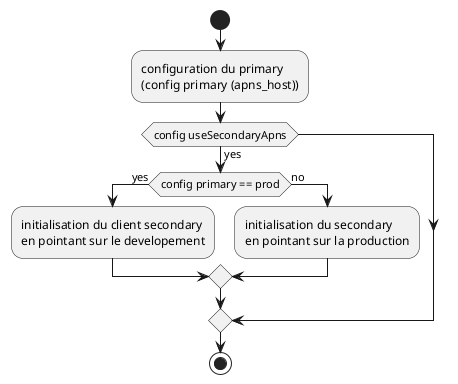
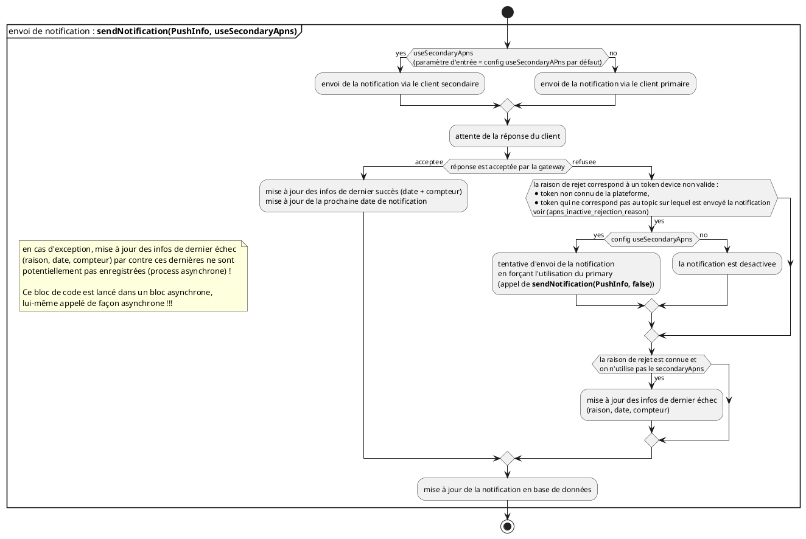

1er diagramme : montrer que l'init inverse primary et secondary selon la valeur de apnHost

Les hosts des servers APNs:
* prod = api.push.apple.com
* development = api.sandbox.push.apple.com

2nd diagramme envoi de notification : montrer que l'APN de developement est prioritaire sur l'APN de prod.

L'envoi de notification est conditionne par l'activation du second apn client (apns_secondary_enable).

La configuration en production active ce mode de fonctionnement.

Ci-dessous la configuration en fonction des plateformes

|parameter             | integration                | pre prod                  | prod                  |
|----------------------|----------------------------|---------------------------|-----------------------|
|apns_host             | api.sandbox.push.apple.com | api.push.apple.com        | api.push.apple.com    |
|apns_secondary_enable | true                       | true                      | true                  |
|apns_topic            | fr.gouv.stopcovid-int.ios  | fr.gouv.stopcovid-int.ios | fr.gouv.stopcovid.ios |

cette configuration donne donc 

|platform    | primary     | secondary   | summary |
|----------  |-------------|-----------  | --------|
|integration | development | prod        | l'application envoie les notifications en priorité sur la gateway de prod puis, si besoin, sur development        | 
|pre prod    | prod        | development | l'application envoie les notifications en priorité sur la gateway de development puis, si besoin, sur prod        |
|production  | prod        | development | l'application envoie les notifications en priorité sur la gateway de development puis, si besoin, sur prod        |

`apns_inactive_rejection_reason`: BadDeviceToken,DeviceTokenNotForTopic : même configuration quelque soit la plateforme. 
